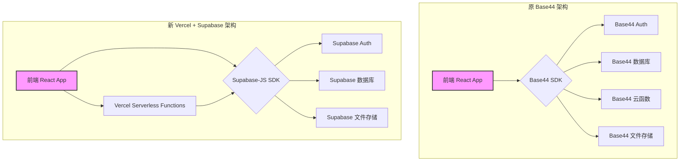

# GraylumAI 迁移技术交接文档

**文档版本**: 1.0
**生成日期**: 2026-01-14

---

## 1. 架构对比与服务映射

本次迁移的核心是将项目从一个高度集成的 BaaS 平台（Base44）迁移到一个由 Vercel 和 Supabase 组成的现代化、可组合的技术栈。下表详细对比了新旧架构的服务映射关系。

### 1.1. 架构对比表

| 功能模块 | 原 Base44 架构 | 新 Vercel + Supabase 架构 | 迁移要点 |
|---|---|---|---|
| **前端托管** | Base44 平台 | **Vercel** | 利用 Vercel 的 Git 集成实现 CI/CD，自动部署 React 应用。 |
| **后端计算** | Base44 云函数 (Functions) | **Vercel Serverless Functions** | 将 `functions/*.ts` 文件一对一迁移为 Vercel 的无服务器函数。 |
| **数据库** | Base44 数据实体 (Entities) | **Supabase Database (PostgreSQL)** | 需要将 Base44 的实体模型转换为标准的 SQL 表结构。 |
| **用户认证** | Base44 Auth | **Supabase Auth** | 替换所有 `base44.auth` 调用为 `supabase.auth` 的等效方法。 |
| **文件存储** | Base44 内置存储 | **Supabase Storage** | 用于存储用户上传的头像、附件等文件。 |
| **API 网关** | Base44 平台 | **Vercel (自动处理)** | Vercel 自动为 Serverless Functions 创建 API 路由。 |
| **环境变量** | Base44 控制台 | **Vercel 项目设置** | 将所有密钥和配置（如 `VITE_BASE44_APP_ID`）迁移到 Vercel 的环境变量中。 |

### 1.2. 服务映射关系图

为了更直观地展示架构的变迁，以下是新旧架构的服务映射图。


*（注意：此图为 Mermaid 格式，可在支持的 Markdown 查看器中渲染）*

---

## 2. 迁移路线图

迁移过程将分阶段进行，以确保业务的平稳过渡和数据的完整性。建议遵循以下路线图：

### 2.1. 阶段一：环境搭建与数据库迁移

**目标**: 准备好新的基础设施，并完成数据的迁移。

1.  **创建 Supabase 项目**: 在 Supabase 官网创建一个新项目，获取项目 URL 和 `anon` / `service_role` API 密钥。
2.  **设计数据库 Schema**: 根据评估报告中的数据实体分析，在 Supabase 的 SQL 编辑器中创建对应的 PostgreSQL 表。需要特别注意字段类型、主外键关系和行级安全策略（RLS）。
3.  **编写数据迁移脚本**: 创建一个 Node.js 或 Python 脚本，用于：
    - 从 Base44 导出所有数据（可能需要联系 Base44 支持或使用其提供的导出工具）。
    - 将导出的数据（通常是 JSON 或 CSV 格式）转换为符合新 Schema 的格式。
    - 使用 `supabase-js` 客户端将数据批量导入到 Supabase 数据库中。
4.  **验证数据完整性**: 编写查询来验证迁移后的数据行数、关联关系是否与原数据一致。

### 2.2. 阶段二：认证系统迁移

**目标**: 将用户认证系统从 Base44 Auth 切换到 Supabase Auth。

1.  **配置 Supabase Auth**: 在 Supabase 控制台配置认证提供商（如邮箱密码、社交登录等），并设置邮件模板。
2.  **改造前端认证逻辑**: 
    - 移除 `@base44/sdk`，添加 `@supabase/supabase-js`。
    - 创建一个新的 `SupabaseProvider` 来替代 `AuthContext`，用于管理 Supabase 的用户会话。
    - 重写登录、注册、登出等组件和逻辑，调用 `supabase.auth.signInWithPassword()`, `supabase.auth.signUp()`, `supabase.auth.signOut()` 等方法。
    - 用户信息获取从 `base44.auth.me()` 改为 `supabase.auth.getUser()`。
3.  **用户数据迁移**: 将 Base44 的用户数据（特别是邮箱和加密后的密码，如果可获取）导入到 Supabase Auth 的 `auth.users` 表中。如果无法直接迁移密码，需要引导用户进行密码重置。

### 2.3. 阶段三：API/云函数迁移

**目标**: 将所有后端业务逻辑迁移到 Vercel Serverless Functions。

1.  **创建 Vercel 项目**: 在 Vercel 上创建一个新项目，并关联到您的 GitHub 代码库。
2.  **迁移云函数**: 
    - 在代码库根目录下创建 `api/` 文件夹（Vercel 默认的 Serverless Functions 目录）。
    - 将 `functions/` 目录下的每个 TypeScript 文件移动到 `api/` 目录下，并调整为 Vercel 支持的导出格式。
    - 在每个函数中，将 `base44.entities` 的调用替换为使用 `supabase-js` 客户端的数据库查询。
    - 使用 Vercel 的环境变量来管理 Supabase 的 API 密钥等敏感信息。
3.  **适配前端 API 调用**: 
    - 修改前端所有调用 `base44.functions.invoke()` 的地方，改为使用 `fetch` 或 `axios` 直接请求 Vercel 部署的 API 端点（如 `/api/smartChatWithSearch`）。
    - 确保请求中携带了 Supabase 的认证 Token（JWT），以便在后端进行用户验证。

### 2.4. 阶段四：前端代码适配与测试

**目标**: 完成前端剩余的适配工作，并进行全面测试。

1.  **更新环境变量**: 移除所有 `VITE_BASE44_*` 环境变量，替换为 `VITE_SUPABASE_URL` 和 `VITE_SUPABASE_ANON_KEY`。
2.  **清理无用代码**: 移除所有与 `@base44/sdk` 相关的代码，包括 `base44Client.js` 和 `@base44/vite-plugin`。
3.  **端到端测试**: 对整个应用进行全面的功能测试，包括：
    - 注册、登录、登出流程。
    - AI 聊天、历史记录、文件上传等核心功能。
    - 管理后台的所有功能模块。
    - 积分系统和工单系统。
4.  **部署上线**: 测试通过后，将主分支合并，Vercel 将自动完成生产环境的部署。

---

## 3. 技术规范与标准

为了确保迁移后代码的质量和可维护性，建议遵循以下技术规范。

### 3.1. 代码组织结构

- **Serverless Functions**: 所有后端 API 文件应放置在根目录的 `api/` 文件夹下，每个文件对应一个 API 端点。例如，`api/get-user.ts` 将部署到 `https://<your-domain>.vercel.app/api/get-user`。
- **共享代码**: 后端函数之间需要共享的工具函数、类型定义等，可以放在 `api/_lib/` 或 `lib/` 目录下。
- **前端结构**: 保持现有的 `src/` 目录结构，但需要创建一个新的 `lib/supabaseClient.js` 来初始化 Supabase 客户端。

### 3.2. API 命名和错误处理规范

- **命名**: API 文件名和路由建议使用 kebab-case（短横线分隔），例如 `smart-chat`。
- **请求方法**: 明确使用 HTTP 请求方法，如 `POST` 用于创建资源，`GET` 用于获取资源。
- **错误处理**: 后端函数应返回统一的错误格式。建议返回标准的 HTTP 状态码（如 400, 401, 404, 500），并在响应体中包含一个 JSON 对象，如 `{ "error": { "message": "..." } }`。

### 3.3. 环境变量配置规范

- **Vercel**: 
    - `SUPABASE_URL`: Supabase 项目 URL。
    - `SUPABASE_SERVICE_ROLE_KEY`: Supabase 服务角色密钥（用于后端需要管理员权限的操作）。
    - `OPENAI_API_KEY`, `ANTHROPIC_API_KEY`: 第三方 AI 服务的密钥。
- **前端 (Vite)**:
    - `VITE_SUPABASE_URL`: Supabase 项目 URL (公开)。
    - `VITE_SUPABASE_ANON_KEY`: Supabase `anon` 公开密钥 (公开)。

### 3.4. 安全最佳实践

- **密钥管理**: 绝不在前端代码中暴露 `SERVICE_ROLE_KEY` 或任何其他私有密钥。所有需要特权操作的 API 都应通过 Vercel Serverless Functions 调用。
- **行级安全 (RLS)**: 在 Supabase 数据库中为所有包含敏感数据的表启用 RLS 策略，确保用户只能访问自己的数据。
- **CORS 配置**: Vercel 默认处理 CORS，但如果需要更精细的控制，可以在 `vercel.json` 文件中进行配置。
- **输入验证**: 在所有后端 API 函数的入口处，对请求的参数进行严格的验证（推荐使用 `zod`），防止恶意输入。


---

## 4. 数据库 Schema 详细设计

基于对原项目的分析，以下是需要在 Supabase 中创建的完整数据库表结构。该 Schema 设计考虑了数据完整性、查询性能以及与 Supabase Auth 的集成。

### 4.1. 核心表结构

#### **表 1: `profiles` (用户扩展信息)**
此表与 Supabase 的 `auth.users` 表关联，存储应用特定的用户信息。

| 字段名 | 类型 | 约束 | 说明 |
|---|---|---|---|
| `id` | UUID | PRIMARY KEY, REFERENCES auth.users(id) | 用户 ID，关联到 Supabase Auth |
| `nickname` | TEXT | | 用户昵称 |
| `avatar_url` | TEXT | | 用户头像 URL |
| `role` | TEXT | NOT NULL, DEFAULT 'user' | 用户角色 (user/admin) |
| `credits` | INTEGER | NOT NULL, DEFAULT 100 | 用户积分余额 |
| `created_at` | TIMESTAMPTZ | DEFAULT now() | 账户创建时间 |

**SQL 创建语句**:
```sql
CREATE TABLE public.profiles (
    id UUID PRIMARY KEY REFERENCES auth.users(id) ON DELETE CASCADE,
    nickname TEXT,
    avatar_url TEXT,
    role TEXT DEFAULT 'user' NOT NULL CHECK (role IN ('user', 'admin')),
    credits INTEGER DEFAULT 100 NOT NULL,
    created_at TIMESTAMPTZ DEFAULT now()
);

CREATE INDEX idx_profiles_role ON public.profiles(role);
```

#### **表 2: `conversations` (AI 对话)**
存储用户与 AI 的完整对话历史。

| 字段名 | 类型 | 约束 | 说明 |
|---|---|---|---|
| `id` | UUID | PRIMARY KEY, DEFAULT gen_random_uuid() | 对话唯一标识 |
| `user_id` | UUID | REFERENCES auth.users(id) ON DELETE CASCADE | 对话所属用户 |
| `title` | TEXT | NOT NULL | 对话标题 |
| `messages` | JSONB | | 消息数组 (JSON 格式) |
| `model_id` | TEXT | | 使用的 AI 模型 ID |
| `is_archived` | BOOLEAN | DEFAULT false | 是否已归档 |
| `total_credits_used` | INTEGER | DEFAULT 0 | 该对话累计消耗的积分 |
| `created_at` | TIMESTAMPTZ | DEFAULT now() | 创建时间 |
| `updated_at` | TIMESTAMPTZ | DEFAULT now() | 最后更新时间 |

**SQL 创建语句**:
```sql
CREATE TABLE public.conversations (
    id UUID PRIMARY KEY DEFAULT gen_random_uuid(),
    user_id UUID REFERENCES auth.users(id) ON DELETE CASCADE,
    title TEXT NOT NULL,
    messages JSONB,
    model_id TEXT,
    is_archived BOOLEAN DEFAULT false,
    total_credits_used INTEGER DEFAULT 0,
    created_at TIMESTAMPTZ DEFAULT now(),
    updated_at TIMESTAMPTZ DEFAULT now()
);

CREATE INDEX idx_conversations_user_id ON public.conversations(user_id);
CREATE INDEX idx_conversations_created_at ON public.conversations(created_at DESC);
```

#### **表 3: `credit_transactions` (积分交易记录)**
记录用户积分的所有变动流水。

| 字段名 | 类型 | 约束 | 说明 |
|---|---|---|---|
| `id` | SERIAL | PRIMARY KEY | 交易记录 ID |
| `user_id` | UUID | REFERENCES auth.users(id) ON DELETE CASCADE | 用户 ID |
| `amount` | INTEGER | NOT NULL | 变动金额（正数为增加，负数为扣除） |
| `type` | TEXT | NOT NULL | 交易类型 (purchase/reward/usage) |
| `description` | TEXT | | 交易描述 |
| `created_at` | TIMESTAMPTZ | DEFAULT now() | 交易时间 |

**SQL 创建语句**:
```sql
CREATE TABLE public.credit_transactions (
    id SERIAL PRIMARY KEY,
    user_id UUID REFERENCES auth.users(id) ON DELETE CASCADE,
    amount INTEGER NOT NULL,
    type TEXT NOT NULL CHECK (type IN ('purchase', 'reward', 'usage')),
    description TEXT,
    created_at TIMESTAMPTZ DEFAULT now()
);

CREATE INDEX idx_credit_transactions_user_id ON public.credit_transactions(user_id);
CREATE INDEX idx_credit_transactions_created_at ON public.credit_transactions(created_at DESC);
```

#### **表 4: `ai_models` (AI 模型配置)**
存储可用的 AI 模型及其配置信息。

| 字段名 | 类型 | 约束 | 说明 |
|---|---|---|---|
| `id` | TEXT | PRIMARY KEY | 模型唯一标识 |
| `name` | TEXT | NOT NULL | 模型显示名称 |
| `provider` | TEXT | NOT NULL | 提供商 (anthropic/openai/google) |
| `endpoint` | TEXT | | API 端点 URL |
| `config` | JSONB | | 模型配置参数 (JSON) |
| `is_active` | BOOLEAN | DEFAULT true | 是否启用 |
| `created_at` | TIMESTAMPTZ | DEFAULT now() | 创建时间 |

**SQL 创建语句**:
```sql
CREATE TABLE public.ai_models (
    id TEXT PRIMARY KEY,
    name TEXT NOT NULL,
    provider TEXT NOT NULL CHECK (provider IN ('anthropic', 'openai', 'google', 'custom')),
    endpoint TEXT,
    config JSONB,
    is_active BOOLEAN DEFAULT true,
    created_at TIMESTAMPTZ DEFAULT now()
);
```

#### **表 5: `tickets` (工单系统)**
用户提交的支持工单。

| 字段名 | 类型 | 约束 | 说明 |
|---|---|---|---|
| `id` | SERIAL | PRIMARY KEY | 工单 ID |
| `user_id` | UUID | REFERENCES auth.users(id) ON DELETE CASCADE | 提交用户 |
| `title` | TEXT | NOT NULL | 工单标题 |
| `description` | TEXT | | 工单详细描述 |
| `status` | TEXT | DEFAULT 'open' | 工单状态 (open/in_progress/closed) |
| `priority` | TEXT | DEFAULT 'normal' | 优先级 (low/normal/high) |
| `created_at` | TIMESTAMPTZ | DEFAULT now() | 创建时间 |
| `updated_at` | TIMESTAMPTZ | DEFAULT now() | 最后更新时间 |

**SQL 创建语句**:
```sql
CREATE TABLE public.tickets (
    id SERIAL PRIMARY KEY,
    user_id UUID REFERENCES auth.users(id) ON DELETE CASCADE,
    title TEXT NOT NULL,
    description TEXT,
    status TEXT DEFAULT 'open' CHECK (status IN ('open', 'in_progress', 'closed')),
    priority TEXT DEFAULT 'normal' CHECK (priority IN ('low', 'normal', 'high')),
    created_at TIMESTAMPTZ DEFAULT now(),
    updated_at TIMESTAMPTZ DEFAULT now()
);

CREATE INDEX idx_tickets_user_id ON public.tickets(user_id);
CREATE INDEX idx_tickets_status ON public.tickets(status);
```

#### **表 6: `ticket_replies` (工单回复)**
工单的回复记录。

| 字段名 | 类型 | 约束 | 说明 |
|---|---|---|---|
| `id` | SERIAL | PRIMARY KEY | 回复 ID |
| `ticket_id` | INTEGER | REFERENCES tickets(id) ON DELETE CASCADE | 所属工单 |
| `user_id` | UUID | REFERENCES auth.users(id) ON DELETE CASCADE | 回复用户 |
| `content` | TEXT | NOT NULL | 回复内容 |
| `is_admin_reply` | BOOLEAN | DEFAULT false | 是否为管理员回复 |
| `created_at` | TIMESTAMPTZ | DEFAULT now() | 回复时间 |

**SQL 创建语句**:
```sql
CREATE TABLE public.ticket_replies (
    id SERIAL PRIMARY KEY,
    ticket_id INTEGER REFERENCES public.tickets(id) ON DELETE CASCADE,
    user_id UUID REFERENCES auth.users(id) ON DELETE CASCADE,
    content TEXT NOT NULL,
    is_admin_reply BOOLEAN DEFAULT false,
    created_at TIMESTAMPTZ DEFAULT now()
);

CREATE INDEX idx_ticket_replies_ticket_id ON public.ticket_replies(ticket_id);
```

### 4.2. 行级安全 (RLS) 策略示例

为了保护用户数据，所有表都应启用 RLS 并配置适当的策略。以下是关键表的策略示例：

```sql
-- profiles 表策略
ALTER TABLE public.profiles ENABLE ROW LEVEL SECURITY;

CREATE POLICY "Users can view their own profile" 
ON public.profiles FOR SELECT 
USING (auth.uid() = id);

CREATE POLICY "Users can update their own profile" 
ON public.profiles FOR UPDATE 
USING (auth.uid() = id);

-- conversations 表策略
ALTER TABLE public.conversations ENABLE ROW LEVEL SECURITY;

CREATE POLICY "Users can manage their own conversations" 
ON public.conversations FOR ALL 
USING (auth.uid() = user_id);

-- credit_transactions 表策略
ALTER TABLE public.credit_transactions ENABLE ROW LEVEL SECURITY;

CREATE POLICY "Users can view their own transactions" 
ON public.credit_transactions FOR SELECT 
USING (auth.uid() = user_id);

-- tickets 表策略
ALTER TABLE public.tickets ENABLE ROW LEVEL SECURITY;

CREATE POLICY "Users can manage their own tickets" 
ON public.tickets FOR ALL 
USING (auth.uid() = user_id);

-- 管理员可以查看所有工单
CREATE POLICY "Admins can view all tickets" 
ON public.tickets FOR SELECT 
USING (
    EXISTS (
        SELECT 1 FROM public.profiles 
        WHERE id = auth.uid() AND role = 'admin'
    )
);
```

---

## 5. 参考资源

以下是迁移过程中可能需要参考的官方文档和资源链接：

- **Supabase 官方文档**: https://supabase.com/docs
- **Supabase Auth 指南**: https://supabase.com/docs/guides/auth
- **Supabase Database 指南**: https://supabase.com/docs/guides/database
- **Vercel 部署指南**: https://vercel.com/docs
- **Vercel Serverless Functions**: https://vercel.com/docs/functions/serverless-functions
- **React Router 文档**: https://reactrouter.com/
- **TanStack Query (React Query)**: https://tanstack.com/query/latest
